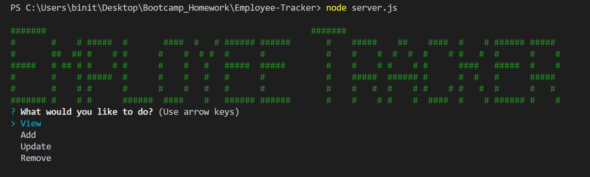
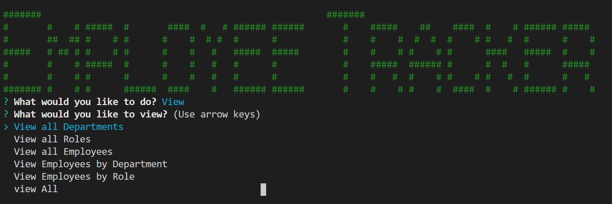

# Employee-Tracker

The objective of the application was to architect and build a solution for managing a company's employees using node, inquirer, and MySQL

## Getting Started

Clone the repository or download and unpack the source code of the project. Install 'npm intall' and all the Dependencies 'chalk' 'inquirer' 'Mysql'

## Database Structure

## Running the Application

# Start

Run 'node server.js'

- The application has four basic options that the user has to choose when it is run.
- View
- Add
- Update
- Remove

# View

- View all Departments
- View all Roles
- View all Employees
- View Employees by Department
- View Employees by Role
- view All

## Authors

- **Prakriti Rajbhandari** - [PrakritiRajbhandari](https://github.com/PrakritiRajbhandari)

## License

This project is licensed under the MIT License - see the [LICENSE.txt] file for details

## Acknowledgments

- Billie Thompson - [PurpleBooth](https://gist.github.com/PurpleBooth) - [README.md](https://gist.github.com/PurpleBooth/109311bb0361f32d87a2) and [CONTRIBUTING.md](https://gist.github.com/PurpleBooth/b24679402957c63ec426) templates.
